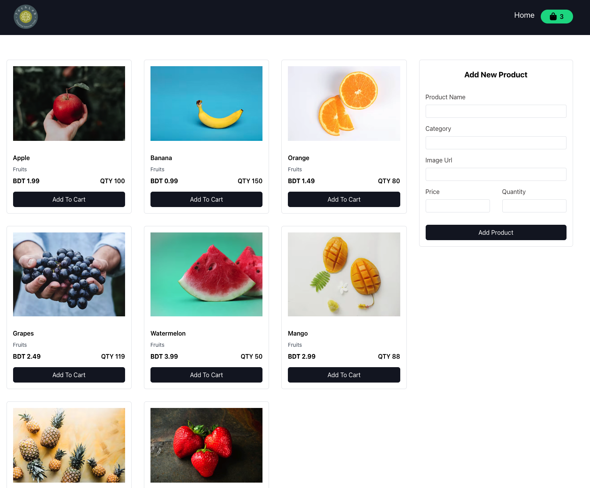
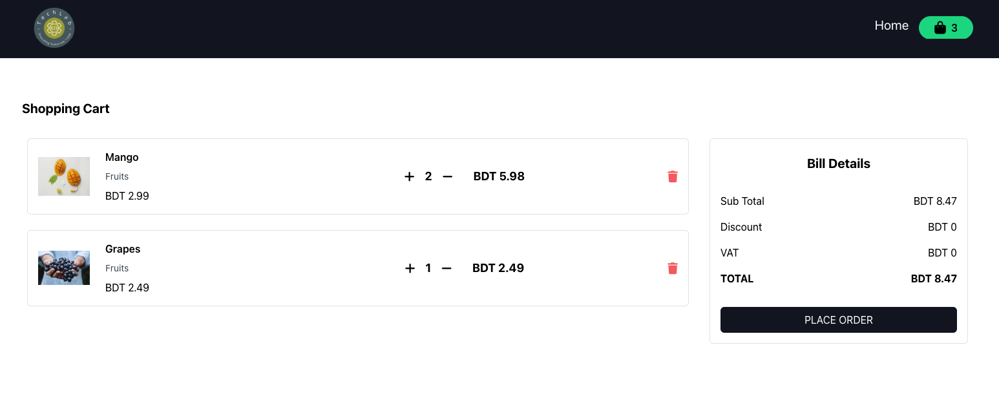

# TechLab | Product Management System

 

## Overview

TechLab's Product Management System is a web application built using React and
Redux for state management. It allows users to manage products, add them to a
cart, adjust quantities, view bill details, and more.

## Features

- **Add New Product:** Users can add new products to the system with details
  such as name, image URL, price, and quantity.
- **Product Listing:** Displays a grid view of all products available in the
  system.
- **Cart Management:** Users can add products to the cart, adjust quantities,
  and remove products from the cart.
- **Billing Details:** Provides a breakdown of the subtotal, total, and bill
  details with dummy discount and VAT for aesthetic purposes.

## Project Structure

The project structure is organized as follows:

- `src/`
     - `actions/`: Contains action creators for Redux actions.
     - `reducers/`: Contains the Redux reducer for managing state.
     - `components/`: React components for UI elements.
     - `pages/`: React components for different pages like Home, Cart, etc.
     - `App.js`: Main component integrating Redux and routing logic.
     - `index.js`: Entry point of the application.

## Getting Started

1. Clone the repository:
   `git clone https://github.com/your-username/techlab-product-management.git`
2. Install dependencies: `npm install`
3. Start the development server: `npm start`

## Usage

- Visit the website and explore the product listing page.
- Add products to the cart, adjust quantities, and view bill details in the cart
  page.

## Technologies Used

- React
- Redux
- JavaScript (ES6+)

## Live Demo

Explore the live demo of the project
[here](https://cart-assignment-by-ahsan.netlify.app/).

